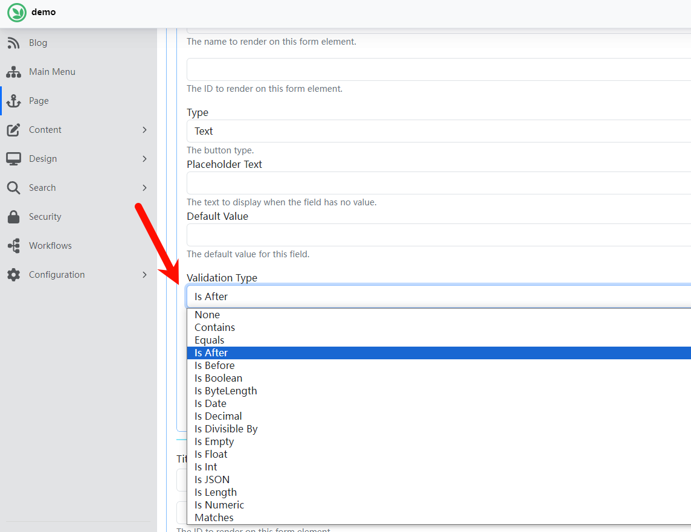

# YuSheng.OrchardCore.Form.Validation
OrchardCore module: Rule-based validation of form module

# Nuget

# Usage

# Notes

Cannot be used together with the official Forms module. 

This module contains the old code of the official Forms module, but does not include the new code. 

There is currently no time to update it. If there is a need, please provide PR.
